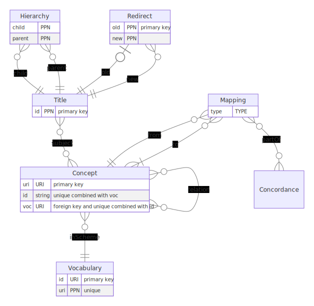

# K10plus Subjects

This repository contains scripts to analyze, convert and publish subject indexing data from K10plus catalog.

## Summary

The data is reduced and cleaned up in four sets:

1. Full K10plus dumps (PICA+):
   *not published so far*
2. Subject-related fields (PICA+):
   <https://doi.org/10.5281/zenodo.6810555> 
3. Vocabularies, identifier, and sources:
   *not published so far*
4. Syntactically valid identifiers of known vocabularies, aka normalized subject indexing data (TSV and RDF):
   <https://doi.org/10.5281/zenodo.7016625>

If not interested in sources and details of cataloging, best use the set 4. For the full picture use set 2.

## Implementation

Requires [pica-rs](https://github.com/deutsche-nationalbibliothek/pica-rs) >= 0.13.0, Bash and Perl to be installed.

- Processing from set 1 to 2 is implemented in `extract-subject-fields.sh`.

- Processing from set 2 to 3 is implemented in `extract-subjects.pl`:

  `cat kxp-subjects-sample_2021-06-30*.dat | ./extract-subjects.pl > subjects.tsv`

- Processing from set 3 to 4 is implemented in `clean-subjects.pl` and `triples.pl`:

Additional error `invalid-ids.tsv` is created during processing.

Final statistics are created in `stats.sh`.

See `Makefile` for execution.

## Obtaining the data

Dumps of subject indexing in K10plus catalog are published yearly to quarterly. Each dump is around 15 Gigabytes (that's around 10% of full K10plus data) and split into multiple files. Copies of the full dump *may* be found at <https://analytics.gbv.de/dumps/kxp/>. Data is provided in [PICA Normalized](https://format.gbv.de/pica/normalized) format with one record per line. 

The data is reduced to data fields used for subject indexing in K10plus catalog and limited to records with at least one library holding. Records without any subject indexing are omitted. See [K10plus format documentation](https://format.k10plus.de/k10plushelp.pl?cmd=pplist&katalog=Standard#titel) and file README.md of the data publication for details.

Script `zenodo-get` in this repository can be used for automatic download from published data at Zenodo.

The TSV file `subjects.tsv` can be generated with `extract-subjects.pl`, it is not published yet. The file file contains four columns:

1. Bibliographic record identifier (PPN)
2. Vocabulary symbol
3. Notation or identifier in the vocabulary (subfield `$a` in most cases)
4. source (in most cases subfield `$A`, if available). Multiple sources are concatenated with separator `|`.

**Note:** Source field `$A` for GND contains other data as well unless [this issue](https://github.com/gbv/k10plus-subjects/issues/15) has been fixed, so use with care!

The data can also be used to detect cataloging errors such as invalid notations etc.

Normalized subject indexing data in TSV only contains column 1-3, limited to syntactically valid notations of selected vocabularies (see `vocabularies.json`).

See <https://coli-conc.gbv.de/occurrences/> for an API that makes use of this data.

## Model

## Changes

2022-03-31:
 - RDF Dump includes skos:inScheme statements
